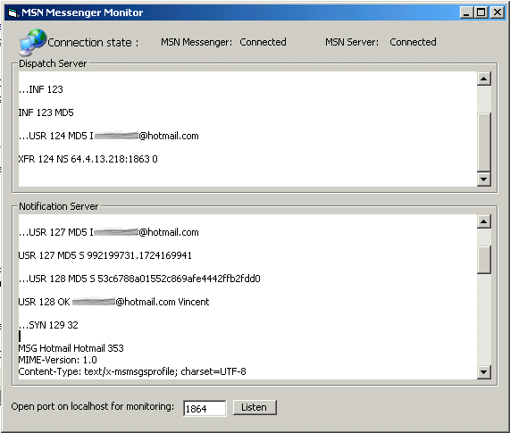



## MSN Messenger Monitor \(Fixed\)

### Description

This program is a simple monitor for MSN Messenger Service. You just have to boot this, and then log normally with MSN Messenger. The app will act as a monitor to show you how the client is communicating with Microsoft servers. I actually did a complete MSN Messenger Client from scratch and compatible with existing protocol and I will soon post it here. With this monitor, you should have a great idea of the great communication procotol. For the complete MSN Messenger Protocol goto: http://www.tlsecurity.net/Textware/Misc/draft-movva-msn-messenger-protocol-00.txt Don't forget to change your registry settings: HKEY_CURRENT_USER\Software\Microsoft\MessengerService\' find the key "Server" and change it to 127.0.0.1;127.0.0.1:1863 and don't forget to backup your original values. If you already erased it, the initial value that should work is messenger.hotmail.com;127.0.0.1:1863
 
### More Info
 

             |
---                |---
**Submitted On**   |2001-06-10 15:28:18
**By**             |[Vincent Bouret](https://github.com/Planet-Source-Code/PSCIndex/blob/master/ByAuthor/vincent-bouret.md)
**Level**          |Intermediate
**User Rating**    |4.0 (20 globes from 5 users)
**Compatibility**  |VB 5\.0, VB 6\.0
**Category**       |[Internet/ HTML](https://github.com/Planet-Source-Code/PSCIndex/blob/master/ByCategory/internet-html__1-34.md)
**World**          |[Visual Basic](https://github.com/Planet-Source-Code/PSCIndex/blob/master/ByWorld/visual-basic.md)
**Archive File**   |[MSN Messen213866192001\.zip](https://github.com/Planet-Source-Code/vincent-bouret-msn-messenger-monitor-fixed__1-24236/archive/master.zip)

